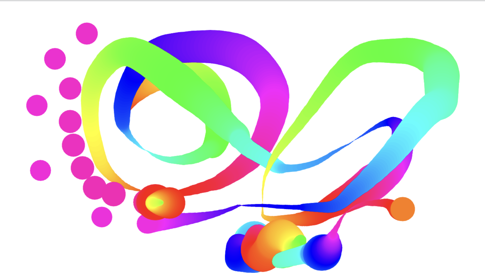

# HTML_canvas

This is a 30-days javascript grinding  
js30 [https://github.com/ningh98/js30]    
7. html canvas [https://github.com/ningh98/HTML_canvas]

## Table of contents

- [Overview](#overview)
  - [Screenshot](#screenshot)
  - [Links](#links)
- [My process](#my-process)
  - [Built with](#built-with)
  - [What I learned](#what-i-learned)


## Overview

 A JavaScript application that allows the user to draw on an HTML canvas element with dynamic colors and line widths. It uses event listeners to handle mouse interactions and the Canvas API to draw on the canvas.

### Screenshot



### Links

- Live Site URL: [https://ningh98.github.io/HTML_canvas/]

## My process

### Built with

- HTML
- CSS
- Javascript


### What I learned


```js
  canvas.addEventListener('mousemove', draw)
  canvas.addEventListener('mousedown', (e) => {
      isDrawing = true
      lastX = e.offsetX
      lastY = e.offsetY
  })
  canvas.addEventListener('mouseup', () => isDrawing = false)
  canvas.addEventListener('mouseout', () => isDrawing = false)
```
use even listener to change condition based on different action


